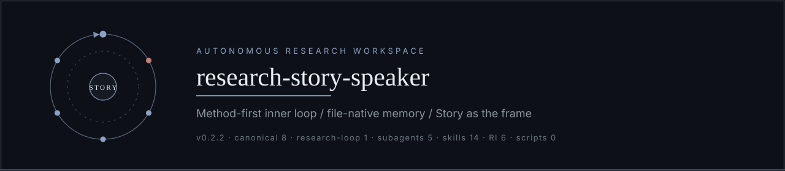
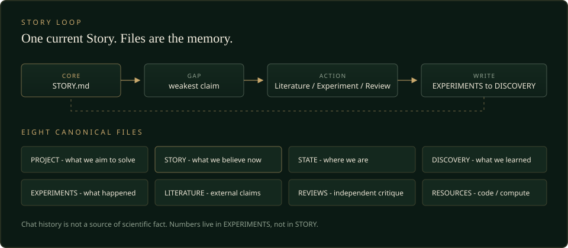

  

<h1 align="center">research-story-speaker</h1>

  <strong>纯文件、纯提示词的 Story 驱动自主科研工作区。</strong> 
  当前信念写在 <code>STORY.md</code>；聊天记录不是科研事实来源。

  
  
  
  
  
  
  
  

  <a href="#quick-start">Quick Start</a>
  ·
  <a href="#story-闭环">Story 闭环</a>
  ·
  <a href="#skills-与冻结计数">Skills</a>
  ·
  <a href="#跨-harness">Harness</a>
  ·
  <a href="#当前状态">当前状态</a>
  ·
  <a href="docs/validation/">Validation</a>

---

这不是 Python 包，也不是带服务端的「科研 Agent 产品」。它是一套 **instruction-only** 的工作区模板：框架逻辑在 `AGENTS.md` 与 `.agents/`，项目记忆在 `.research/`。Agent Harness（Codex、Claude Code、Cursor、DeepSeek Harness）读这些文件，围绕**唯一的当前 Story** 做科研循环。

根目录 `.research/` 在本模板上仍是 **UNINITIALIZED**。不要把 MOCK 示例或验证文档当成已完成的研究。

## Quick Start

1. Clone 或以本仓库为模板复制。
2. 用已支持的 Agent Harness 打开该文件夹（Codex、Claude Code、Cursor、DeepSeek Harness；OpenCode 仅文档、未实测）。
3. 对 Agent 说：`Read AGENTS.md and initialize this research project.`
4. Agent 先走 **`workspace-setup`**（不进 `research-loop`）：
   - **算力**：实验在本地还是服务器（有服务器先配服务器）；
   - **代码 Git**：workspace 内 / 与 workspace 并列 / 主要在服务器。  
   答案写入 `.research/RESOURCES.md`。
5. 再提供研究目标与剩余约束。**`workspace-resume`** 将根 `.research/` 从 `UNINITIALIZED` **materialize** 为 `ACTIVE`（八个文件已经在树上，不是新生成），然后进入第一个 Story loop。缺证据的段落保持 `_Not established yet._`，不要编造完整 Story。

闭环示例（MOCK，不是当前项目）：[`examples/mock-flow-detection/`](examples/mock-flow-detection/)。  
审核与 Harness 证据：[`docs/validation/`](docs/validation/)。

## Story 闭环

整个框架围绕当前 `STORY.md` 运转。数字只写进 EXPERIMENTS；STORY 不承载具体性能数字。三层不互相复制：

| 层 | 文件 | 回答的问题 |
|----|------|------------|
| 信念 | `STORY.md` | 我们现在相信什么 |
| 证据链 | `EXPERIMENTS.md` → `DISCOVERY.md` | 发生了什么 → 学到了什么 |
| 导航 | `STATE.md` | 现在在哪、下一步做什么 |

  

八个 canonical 文件：`PROJECT` · `STORY` · `STATE` · `DISCOVERY` · `EXPERIMENTS` · `LITERATURE` · `REVIEWS` · `RESOURCES`。职责与更新顺序见 [`.agents/references/state-files.md`](.agents/references/state-files.md)；循环规则见 [`.agents/references/story-loop.md`](.agents/references/story-loop.md)。

`STORY.md` 固定六段：Problem → Key Observation → Core Idea → Evidence → Boundary → Open Gaps。

### Workspace 不是代码仓库

Workspace 是科研项目的**控制平面和长期记忆**。实验代码 Git 与 workspace Git 分开：

| 模式 | 代码落点 |
|------|----------|
| A | 在 workspace 内（如 `code/`） |
| B | 与 workspace 并列的仓库 |
| C | 在远程服务器；本机只留 workspace |

升级框架时**只合并** `AGENTS.md`、`CLAUDE.md`、`.agents/`、`.claude/`、`adapters/`，**永不覆盖** `.research/`。

## Skills 与冻结计数

v0.2.2 冻结（与树一致，不在 README 里「大约」）：

| 项 | 数量 |
|----|-----:|
| Canonical `.research/` 文件 | 8 |
| `research-loop` | 1 |
| Subagents | 5 |
| Skills | 13 |
| Research Intelligence 参考 | 6 |
| 框架运行时脚本 | 0 |

**Skills（13）**

| Skill | 角色 |
|-------|------|
| `workspace-setup` | 安装与资源个性化（算力 + 代码 Git）。**不进** research-loop |
| `workspace-resume` | 冷启动 / materialize / 陌生 session 续上 |
| `research-loop` | 决定下一步科研 |
| `story-maintenance` | 维护当前 Story |
| `idea-evaluation` | 新 Core Idea、换路线、高代价实验 |
| `literature-research` | 文献 |
| `experiment-design` | 实验设计 |
| `experiment-execution` | 实验执行 |
| `result-analysis` | 结果解释 |
| `evidence-verification` | 拟写入 Story Evidence 的结果 |
| `experiment-review` | 独立 Review |
| `research-memory` | 状态文件一致性 |
| `framework-maintenance` | 仅维护框架、升级 Harness 或发版 |

**Subagents（5）**：`research-lead` · `literature-scout` · `experiment-agent` · `result-analyst` · `reviewer`。Subagent 只写 `.research/work/` 或 reviews；八个 canonical 文件由 Main Agent 更新。

目录三分：框架层（`AGENTS.md` / `.agents/` / `.claude/` / `adapters/`）· 项目层（`.research/`）· 示例与验证（`examples/` · `docs/validation/`）。

## 跨 Harness

薄适配在 [`adapters/`](adapters/README.md)。科学逻辑只住在 `AGENTS.md` 与 `.agents/`。

| Harness | 入口 | 状态 |
|---------|------|------|
| Codex | `AGENTS.md` | UNINITIALIZED cold-start 已测 |
| Claude Code | `CLAUDE.md` → `AGENTS.md` | UNINITIALIZED cold-start 已测 |
| Cursor | `AGENTS.md` | UNINITIALIZED cold-start 已测 |
| DeepSeek Harness | `AGENTS.md` | UNINITIALIZED cold-start 已测 |
| OpenCode | `AGENTS.md` | **documentation-only，未实测** |

Cold-start 证据日期 2026-09-03，见 [`docs/validation/harness-smoke/`](docs/validation/harness-smoke/)。Initialized 写回/交接：Codex → Claude Code 有过验证。上表**不是** v0.2.2 的独立 live Gate，也不要把 v0.2.1 Wave G 的判断类结果说成当前发布的新能力。

## 当前状态

**v0.2.2**（tag `v0.2.2`）新增 `workspace-setup`。静态验收：[`docs/validation/v0.2.2/workspace-setup-checklist.md`](docs/validation/v0.2.2/workspace-setup-checklist.md)。**未跑**独立 live Gate。

> [!CAUTION]
> 根 `.research/` 仍为干净 **UNINITIALIZED** 模板。  
> v0.2.1 Wave G 的 compact token 软目标在 Codex 与 Claude Code 上均为 **MISS**（retune / retune2 仍为 MISS）。路由变轻了，但 agent 仍会整文件读入 `SKILL.md`。**不要声称 compact 成功。**

较早发布（对象与 tag 不移动）：

- **v0.2.1** — Gate A **APPROVE**；Gate B **APPROVE_V0_2_1**。live Wave G：G2/G4 **PASS**，G3 **ADVANCE PASS**，G5 **reject**（不部署）。证据：[`docs/validation/v0.2.1/`](docs/validation/v0.2.1/)。
- **v0.2** — Research Intelligence Layer（6 份 Layer 2 参考、`idea-evaluation` / `evidence-verification`）。FROZEN CORE 相对 v0.1.1 byte-identical。行为边界见 [`docs/validation/research-intelligence/`](docs/validation/research-intelligence/)。
- **v0.1 / v0.1.1** — 基线闭环与对象冻结。

已知债务：OpenCode 未实测；compact token 软目标仍 MISS。没有可引用的论文数字或对外 benchmark。GitHub README 展示手法调研：[`docs/validation/v0.2.2/github-readme-study.md`](docs/validation/v0.2.2/github-readme-study.md)。
