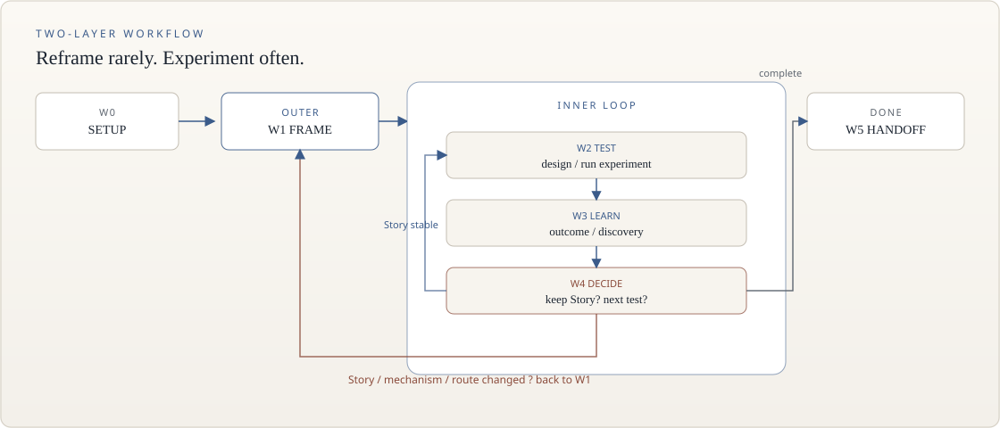

<p align="center">
  
</p>

<h1 align="center">research-story-speaker</h1>

<p align="center">
  <strong>一个 Story。一套文件记忆。一个 Method-First 循环。</strong><br>
  纯文件、纯提示词的自主科研工作区 —— 聊天记录不是事实来源。
</p>

<p align="center">
  <a href="https://github.com/Her-xanadu/research-story-speaker/releases/tag/v0.3.0"></a>
  
  
  
  
  
</p>

<p align="center">
  <a href="#这是什么">这是什么</a>
  ·
  <a href="#核心机制">核心机制</a>
  ·
  <a href="#开始使用">开始使用</a>
  ·
  <a href="#能力边界">能力边界</a>
  ·
  <a href="#跨-harness">Harness</a>
  ·
  <a href="#仓库边界">仓库边界</a>
  ·
  <a href="#当前状态">当前状态</a>
</p>

---

## 这是什么

这是一套 **instruction-only** 的工作区模板，不是 Python 包，也不是带服务端的「科研 Agent 产品」。

| | 含义 |
|---|---|
| **是** | Agent 读 `AGENTS.md` 与 `.agents/`，围着**唯一当前 Story** 做科研 |
| **记忆** | 写在 `.research/` 的八个文件里，不在聊天记录里 |
| **不是** | 第二个编排器、第二套状态库、运行时脚本、或把 Web 搜索结果当成已读文献 |

根目录 `.research/` 在本模板上仍是 **UNINITIALIZED**。不要把 MOCK 示例或验证文档当成已完成的研究。

---

## 核心机制

逻辑只有三条，顺序固定：

```text
1. STORY.md = 今天还相信什么
2. 文件 = 长期记忆（发生了什么 / 学到了什么 / 下一步）
3. Workflow = 外层换问题，内层 Method-First
```

### 1. 一个 Story

`STORY.md` 固定六段，大约一页，**不写性能数字**：

```text
Problem → Key Observation → Core Idea → Evidence → Boundary → Open Gaps
```

Experiment 可以有几十轮；Story 不应跟着膨胀。数字进 `EXPERIMENTS.md`。

### 2. 文件即记忆

| 层 | 文件 | 回答 |
|----|------|------|
| 信念 | `STORY.md` | 我们现在相信什么 |
| 证据 | `EXPERIMENTS.md` → `DISCOVERY.md` | 发生了什么 → 学到了什么 |
| 游标 | `STATE.md` | 现在在哪、下一步做什么 |

<p align="center">
  
</p>

八个 canonical 文件：`PROJECT` · `STORY` · `STATE` · `DISCOVERY` · `EXPERIMENTS` · `LITERATURE` · `REVIEWS` · `RESOURCES`。

职责与更新顺序：[`.agents/references/state-files.md`](.agents/references/state-files.md)。

**文献两层不要混：** 人级 Obsidian 库（`paper-consult` / `paper-find` / `paper-library`，在 `~/.agents/skills/`，不进本仓库）≠ 项目 `.research/LITERATURE.md`。Web 结果 ≠ 文献记忆。

### 3. 两层 Workflow

**不要**每个实验都重新问「现在最大 Gap 是什么」。

<p align="center">
  
</p>

| 层 | 路径 | 何时走 |
|----|------|--------|
| **内循环（默认）** | `W2 TEST → W3 LEARN → W4 DECIDE → W2` | 同一 Story 下连续实验 |
| **外循环（低频）** | `W4 → W1 FRAME` | Core Idea 被推翻、路线无信息增益、或出现需重新 frame 的矛盾 |
| **完成** | `W4 → W5 HANDOFF` | Story 完成条件满足 |

长周期把内循环花在 **Method-First**：方法假设 → 判别实验 → 机制诊断 → 方法更新（keep / simplify / replace）。不要重画 W0–W5。

| 规则 | 含义 |
|------|------|
| 新 EXP | 必须能改变科学判断；否则不铸新 ID |
| Support | parser / schema / UUID / 工程修复：不铸 ID、不全量 Review、不改 Story、不回 W1 |
| 换挡 | 问题清楚则继续 Method Loop，默认 `W4 → W2` |
| Review | 看 scientific stakes，不是 `reviewer available` |
| 冷启动 | 不把整本 `EXPERIMENTS.md` 当默认上下文 |

`STATE.md` 的 **Workflow Position** 是宏观游标。完整规则：[`.agents/references/story-loop.md`](.agents/references/story-loop.md)。验收用例：[`docs/validation/method-first-longrun/`](docs/validation/method-first-longrun/)。

### Workspace 不是代码仓库

| 模式 | 实验代码落点 |
|------|----------------|
| A | workspace 内（如 `code/`） |
| B | 与 workspace 并列的仓库 |
| C | 远程服务器；本机只留 workspace |

升级框架时**只合并** `AGENTS.md`、`CLAUDE.md`、`.agents/`、`.claude/`、`.codex/agents/`、`.cursor/`、`adapters/`，**永不覆盖** `.research/`。

---

## 开始使用

一种安装：clone 后用 Codex、Claude Code 或 Cursor **打开同一个文件夹**。三套 harness 配置已经都在仓库里，不必按框架分别安装。以后换框架，还是这个 workspace。

1. Clone 或以本仓库为模板复制。
2. 用 Codex / Claude Code / Cursor 打开该文件夹。
3. 对 Agent 说：`Read AGENTS.md and initialize this research project.`（Claude Code 会先自动读 `CLAUDE.md`，再指向 `AGENTS.md`。）
4. Agent 先走 **`workspace-setup`**（不进 `research-loop`）：算力在哪、代码 Git 在哪 → 写入 `.research/RESOURCES.md`。
5. 再给研究目标。**`workspace-resume`** 把根 `.research/` 从 `UNINITIALIZED` **materialize** 为 `ACTIVE`（八个文件已在树上，不是新生成）。缺证据的段落保持 `_Not established yet._`。

其它 Agent 框架（DeepSeek Harness、OpenCode、Trae 等）官方不维护安装器：把入口和 Subagent 发现路径指到 `AGENTS.md` 与 `.agents/` 即可。见 [`adapters/README.md`](adapters/README.md)。

MOCK 闭环（不是当前项目）：[`examples/mock-flow-detection/`](examples/mock-flow-detection/)。  
审核证据：[`docs/validation/`](docs/validation/)。Method-First 长周期：[`docs/validation/method-first-longrun/`](docs/validation/method-first-longrun/)。

---

## 能力边界

冻结计数与树一致，不在 README 里「大约」：

| 项 | 数量 |
|----|-----:|
| Canonical `.research/` 文件 | 8 |
| `research-loop` | 1 |
| Subagents | 5 |
| Skills | 15 |
| Research Intelligence 参考 | 6 |
| 框架运行时脚本 | 0 |

**科研路径（进 loop）**

| Skill | 角色 |
|-------|------|
| `workspace-resume` | 冷启动 / materialize |
| `research-loop` | 决定下一步；内循环已清楚时跳过 |
| `literature-research` | 文献（本地库优先） |
| `experiment-design` / `execution` / `monitor-experiment` / `result-analysis` | 内循环 W2–W3：发射后静默监控，不要空转思考 |
| `story-maintenance` | 维护当前 Story |
| `idea-evaluation` | 新 Core Idea / 换路线 |
| `evidence-verification` / `experiment-review` | 高风险证据与独立 Review |
| `research-memory` | 状态文件一致性 |

**不进 research-loop**

| Skill | 角色 |
|-------|------|
| `workspace-setup` | 算力 + 代码 Git |
| `framework-maintenance` | 审计、回归、发版 |
| `framework-extension` | 扩展设计与接入 |

**Subagents（5）**：`research-lead` · `literature-scout` · `experiment-agent` · `result-analyst` · `reviewer`。只写 `.research/work/` 或 reviews；八个 canonical 文件由 Main Agent 更新。Main 自行决定派不派；模型**每次派发时沿光谱选**（便宜偏弱 → 最强最高 effort），只有**薄下限三类**（独立 Review / 换核心方法 / 进 Story Evidence）保底用最强，见 `AGENTS.md` §模型分档。

目录三分：框架层（`AGENTS.md` / `CLAUDE.md` / `.agents/` / `.claude/` / `.codex/agents/` / `.cursor/` / `adapters/`）· 项目层（`.research/`）· 示例与验证（`examples/` · `docs/validation/`）。

---

## 跨 Harness

薄适配在 [`adapters/`](adapters/README.md)。科学逻辑只住在 `AGENTS.md` 与 `.agents/`。同一 clone 已带上三家会读的文件。

| Harness | 入口 | Skills 发现 | Subagent 谁被调用 | 模型选择 |
|---------|------|-------------|-------------------|--------|
| **Codex**（官方） | `AGENTS.md` | `.agents/skills/` | `.codex/agents/<role>.toml` 的 `name` + `description` | 派发时沿光谱选；`reviewer` 保留原生 `xhigh` 下限，其余 inherit（静态配置，下限见 `adapters/codex.md`） |
| **Claude Code**（官方） | `CLAUDE.md` → `AGENTS.md` | `.claude/skills/<name>` symlink | `.claude/agents/<role>.md` | 派发时沿光谱选；`reviewer` 保留原生 `opus`+`xhigh`，其余 inherit，下限派发升到 `opus`+`xhigh` |
| **Cursor**（官方） | `AGENTS.md` | `.agents/skills/` 与 `.cursor/skills/<name>` symlink | Task `subagent_type=<role>` ← `.cursor/agents/<role>.md` | 全部 inherit，派发时选；下限三类禁止降到 fast Composer。内置 explore/generalPurpose **不是** 五个科研角色 |
| 其它 | 自己把入口指到 `AGENTS.md` | 指到 `.agents/skills/` | 指到 `.agents/subagents/` 或等价配置 | 遵守 `AGENTS.md` §模型分档（光谱 + 薄下限），不要每步都开最强 |

DeepSeek Harness / OpenCode 等：**DIY**，不是官方安装路径。笔记仍在 `adapters/`，不保证跟随升级。

Cold-start 证据日期 2026-09-03，见 [`docs/validation/harness-smoke/`](docs/validation/harness-smoke/)。上表**不是** v0.3.0 的独立 live Gate。

---

## 仓库边界

GitHub 上的根 `.research/` **永远是 UNINITIALIZED 模板**。本仓库不承载某个真实科研项目的实验账本、服务器路径或结果。许可证：[MIT](LICENSE)。贡献约定：[CONTRIBUTING.md](CONTRIBUTING.md)。

若你在自己的 clone 里把它 materialize 成 `ACTIVE`：那是你的科研工作区，不要提交八个 canonical 文件、`.research/work/`、`.research/reviews/` 或 `repos/`。

---

## 当前状态

最近 tagged release 是 **v0.3.0**（Method-First 内循环 + 科研判断连续性）。冻结计数：canonical 8 · research-loop 1 · subagents 5 · Skills 15 · RI 6 · scripts 0。发版审计：[`docs/validation/v0.3.0/`](docs/validation/v0.3.0/)。七组通用场景：[`docs/validation/scientific-continuity.md`](docs/validation/scientific-continuity.md)。**未跑**独立 live Gate。

Method-First 长周期不新增 Workflow Stage / canonical 文件。`monitor-experiment` 是发射后静默等待（不是新 Stage）。Brief：[`docs/validation/extensions/monitor-experiment/`](docs/validation/extensions/monitor-experiment/)。Method-First Cases 1–9 仍是 regression specification（[`docs/validation/method-first-longrun/`](docs/validation/method-first-longrun/)），**尚未** live Gate。

> [!CAUTION]
> 根 `.research/` 仍为干净 **UNINITIALIZED** 模板。  
> v0.2.1 Wave G 的 compact token 软目标在 Codex 与 Claude Code 上均为 **MISS**。路由变轻了，但 agent 仍会整文件读入 `SKILL.md`。**不要声称 compact 成功。**

较早发布（对象与 tag 不移动）：

- **v0.2.2** — `workspace-setup`。静态验收：[`docs/validation/v0.2.2/workspace-setup-checklist.md`](docs/validation/v0.2.2/workspace-setup-checklist.md)。
- **v0.2.1** — Gate A **APPROVE**；Gate B **APPROVE_V0_2_1**。live Wave G：G2/G4 **PASS**，G3 **ADVANCE PASS**，G5 **reject**。证据：[`docs/validation/v0.2.1/`](docs/validation/v0.2.1/)。
- **v0.2** — Research Intelligence Layer。FROZEN CORE 相对 v0.1.1 byte-identical。
- **v0.1 / v0.1.1** — 基线闭环与对象冻结。

已知债务：OpenCode / DeepSeek 等为 DIY、官方不跟装；compact token 软目标仍 MISS。没有可引用的论文数字或对外 benchmark。

视觉资产：`docs/assets/hero-banner.jpg` 为首屏封面（Method-First 循环）；`banner.svg` / `architecture.svg` / `workflow.svg` 为可读矢量图。完整生成图见 `hero.jpg`、`social-card.jpg`。展示手法调研：[`docs/validation/v0.2.2/github-readme-study.md`](docs/validation/v0.2.2/github-readme-study.md)。
